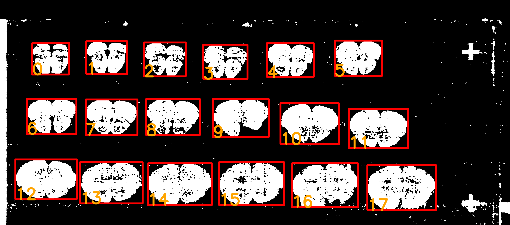
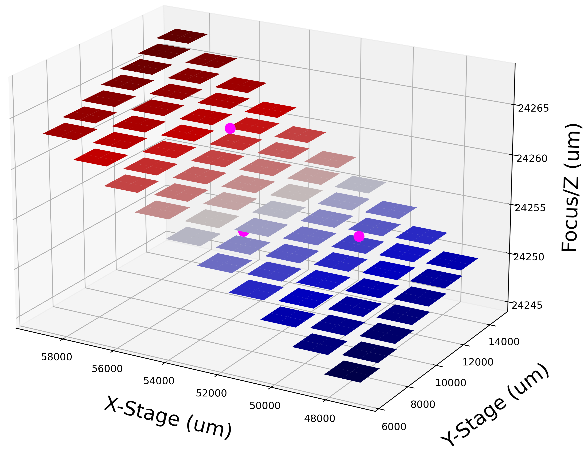

# DMC-FluoImager
DMC-FluoImager is a Python project that automates whole slide image acquisition on microscope camera. 

The aim of this project is to free researchers from manually setting ROIs and to make manual focus of tiles effortless, so that faster and more consistent image acquisition can be achieved with any microscope equipped with a motorized stage. 

DMC-FluoImager relies on Pycro-Manager (1) and Micro-Manager (2,3) for hardware control and OpenCV (4) for image processing. 

# Getting Started
The image acquisition workflow with DMC-FluoImager is presented to the user with interactive Jupyter (5) code cells. The user starts by opening Micro-Manager software then initializes a scanner variable

```python
from device_driver import Scanner
scanner = Scanner()
```
, where the user can specify information related to the acquisition process. 
```python
scanner.root = 'histology_folder'
scanner.animal_id = 'A-001'
scanner.obj_id = 'slide_1'
scanner.createFolder()
```
The last line will create a folder structure:
```
histology_folder
└── A-001
```

The next step is to do a fast 5X (1.28um/pixel) scan to get a general overview on what is on the slide.
```python
scanner.scan_5x() 
```
When 5X scan completes, the folder structure will look like this:
```
histology_folder
└── A-001/
    └── raw/
        └── slide_1/
            └── slide_1_meta
```
Data from 5X scan was saved in 'slide_1_meta' folder for the detection of ROIs. Before running automatic ROIs detection, the user can specify the shape constraint for ROI.
```python
scanner.roiarea_min = 'int:minimum_pixel_number'
scanner.roiarea_max = 'int:maximum_pixel_number'
scanner.roi_w_min = 'int:minimum_width_in_pixel'
scanner.roi_h_max = 'int:maximum_height_in_pixel'

scanner.roi_detection()
```
Detected ROIs are highlighted with a bounding box and labeled with ROI identifier.


Before confirming on detected ROIs, it's possible to merge several small ROIs into one bigger ROI or delete unwanted ROIs.
```python
scanner.merge([0,1,2,3,4,5])
scanner.delete([15,16,17])
scanner.confirm_roi()
```
Or, the user can manually select their custom defined ROI boxes with the ROI selection tool:
```python
scanner.roi_select_tool()
```
The next step is for the user to give input on focus plane for each ROI. XY-stage on microscope will move the slide 3 times and prompt the user with a live window to adjust focus. This information is later used to interpolate for each tile's ideal Z-axis location.
```python
scanner.get_pl_focus('str:channel_name')
```


After getting all information for the acquisition event, the user can start acquisition by:
```python
for channel in ['cy3','green','str:channel_name']:
    scanner.acq(channel)
```
The final acquired dataset will be structured like this:
```
histology_folder
└── A-001/
    └── raw/
        └── slide_1/
            ├── slide_1_meta
            ├── slide_1_cy3
            └── slide_1_green
```
Which can be then easily stitched and processed in napari-dmc-brainmap.

# Reference
1.	Pinkard, H., Stuurman, N., Ivanov, I.E. et al. Pycro-Manager: open-source software for customized and reproducible microscope control. Nat Methods 18, 226–228 (2021). https://doi.org/10.1038/s41592-021-01087-6
2.	Arthur D Edelstein, Mark A Tsuchida, Nenad Amodaj, Henry Pinkard, Ronald D Vale, and Nico Stuurman (2014), Advanced methods of microscope control using μManager software. Journal of Biological Methods 2014 1(2):e11 <doi:10.14440/jbm.2014.36>
3.	Arthur Edelstein, Nenad Amodaj, Karl Hoover, Ron Vale, and Nico Stuurman (2010), Computer Control of Microscopes Using μManager. Current Protocols in Molecular Biology 14.20.1-14.20.17 <doi:10.1002/0471142727.mb1420s92>
4.	Bradski, G., & Kaehler, A. (2000). OpenCV. Dr. Dobb’s journal of software tools, 3(2).
5.	B. E. Granger and F. Pérez, "Jupyter: Thinking and Storytelling With Code and Data," in Computing in Science & Engineering, vol. 23, no. 2, pp. 7-14, 1 March-April 2021, doi: 10.1109/MCSE.2021.3059263.
